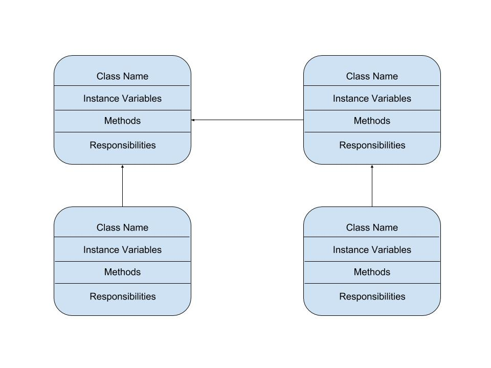

:warning: Everything between << >> needs to be replaced (remove << >> after replacing)

# << Project Title >>
## CS 110 Final Project
### << Semester, Year >>
### [Assignment Description](https://drive.google.com/open?id=1HLIk-539N9KiAAG1224NWpFyEl4RsPVBwtBZ9KbjicE)

<< [https://github.com/<repo>](#) >>

<< [link to demo presentation slides](#) >>

### Team: << team name >>
#### << Team Members >>

***

## Project Description
<< Give an overview of your project >>

***    

## User Interface Design
* << A wireframe or drawing of the user interface concept along with a short description of the interface. You should have one for each screen in your program. >>
    * For example, if your program has a start screen, game screen, and game over screen, you should include a wireframe / screenshot / drawing of each one and a short description of the components
* << You should also have a screenshot of each screen for your final GUI >>

***        

## Program Design
* Non-Standard libraries
    * << You should have a list of any additional libraries or modules used (pygame, request) beyond non-standard python. >>
    * For each additional module you should include
        * url for the module documentation
        * a short description of the module
* Class Interface Design
    * << A simple drawing that shows the class relationships in your code (see below for an example). >>
        * 
    * This does not need to be overly detailed, but should show how your code fits into the Model/View/Controller paradigm.
* Classes
    * << You should have a list of each of your classes with a description. >>

***

## Tasks and Responsibilities
* You must outline the team member roles and who was responsible for each class/method, both individual and collaborative.

### Software Lead - << name >>

<< Worked as integration specialist by... >>

### Front End Specialist - << name >>

<< Front-end lead conducted significant research on... >>

### Back End Specialist - << name >>

<< The back end specialist... >>

## Testing
* << Describe your testing strategy for your project. >>
    * << Example >>

* Your ATP

| Step                  | Procedure     | Expected Results  | Actual Results |
| ----------------------|:-------------:| -----------------:| -------------- |
|  1  | Run Counter Program  | GUI window appears with count = 0  |          |
|  2  | click count button  | display changes to count = 1 |                 |
etc...
